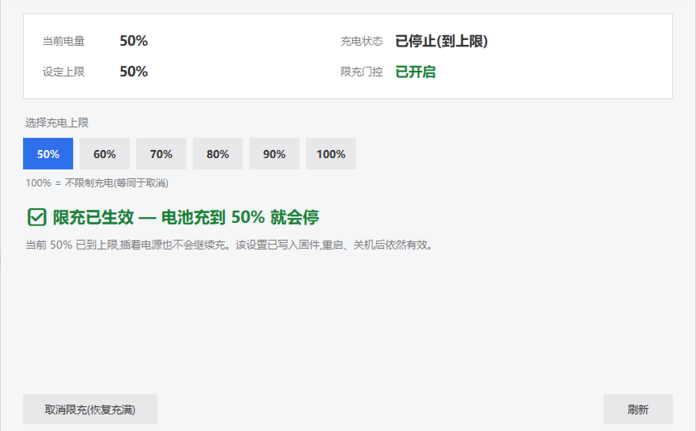

# 机械革命 / 同方笔记本 电池充电上限（Windows）

> 机械革命控制台里的「电池保护模式」设了不生效？想在 Windows 上让电池**插电只充到 50%/60%**？
> 这个项目用**纯软件**做到，且**写入后重启、关机、拔电源都不丢**——不需要开机自启、不需要常驻进程、不需要管理员权限。

适用机型：**采用 Uniwill（同方 / TongFang）EC 固件的笔记本** —— 机械革命（Mechrevo）、XMG、TUXEDO、Eluktronics，以及神舟 / 火影等部分同方模具机型。

实测机型：**机械革命 无界15X（WUJIE15XA，Ryzen 7 8745HS，BIOS N.1.14MRO50）**



---

## 问题：官方开关为什么不管用

- 机械革命控制中心的「电池保护模式」只有三档：长效 100% / 均衡 80% / 工作站 60%，**给不了 50%**；
- 更麻烦的是，**很多机型上设置了完全没效果**，电池照样充到 100%。

根因在 EC 固件的充电控制循环里（逆向伪代码，来自 [w568w](https://gist.github.com/w568w/957976b59906e0ce5d6c13ad342e1593)）：

```c
bool state_is(uint8_t v) { return xram[0x07C3] == v || xram[0x0770] == v; }

bool limit_enabled = state_is(4) || state_is(5);   // 产品线门控
if (!limit_enabled) {
    uint8_t stored = xram[0x087F] & 0x7f;           // 固件存储区
    if (stored == 0 || stored > 100) { disable_control(); return; }
}
enable_control();   // 使用实时上限 xram[0x07B9]
store_limit();      // 实时上限 → 存储区
```

固件只对 `0x07C3`（平台值）或 `0x0770`（ROM ID 首字节）为 4/5 的产品线开放限充。
平台值不匹配 + ROM ID 是出厂空槽 `0xFF` 时，**门控永远不成立，`0x07B9` 写了也没人执行**。

## 解决思路：不要钉门控，要触发固件存储

常见做法是硬钉 `0x0770 = 0x04` 骗过门控（[losewayy 的项目](https://github.com/losewayy/uniwill-ec-charge-limit)），但这条路：

- 改了「机型身份字节」，有副作用风险
- 值**易失**，必须常驻 watcher 或开机重放

本项目走另一条路：**让门控条件临时成立几秒，固件就会把实时上限抄进存储区；之后门控由存储值自己维持**。用完即还，零残留：

```
1. 写 0x07B9 = <上限%>                # 设定实时上限
2. 写 0x07C3 = 0x04,保持 2.5 秒        # 临时让门控成立,固件趁机 store_limit()
3. 写回 0x07C3 = 原值（本机 0x07）     # 用完即还
4. 等 7 秒后读 0x0742 bit2 = 1 → 成功
```

### 实测持久性

| 场景 | 结果 |
|---|---|
| 重启 | ✅ 保持 |
| 关机 + 拔电源 + 断电 10 分钟 | ✅ 保持 |
| 之后插电，从 48% 充起 | ✅ 精确停在 50%（`Charging=False` / `ChargeRate=0`） |
| 需要后台程序吗 | ❌ 完全不需要（实测全程无任何软件运行） |
| 需要管理员权限吗 | ❌ 不需要 |
| 动过身份字节吗 | ❌ 没有，`0x0770` 始终是 `0xFF` |

> 注：EC 由电池持续供电，所以只有**电池被放到彻底没电**时才会丢——那种情况下重新点一次按钮即可。

## 使用

```powershell
pythonw 电池充电上限.pyw
```

界面提供：

- 状态四格：当前电量 / 充电状态 / 设定上限 / 限充门控
- 档位按钮：50 / 60 / 70 / 80 / 90 / 100 %
- 「取消限充（恢复充满）」：一键清除实时上限与固件存储值，电池恢复充电（实测 12 秒内 `ChargeRate=34034 mW`）

**依赖**：Python 3（标准库即可，需要 tkinter）+ 机械革命控制中心（提供 `UWACPIDriver.sys` 设备节点 `\\.\ACPIDriver`）。

## 取消 / 还原

点界面上的「取消限充（恢复充满）」即可。它会：

1. 把 `0x07B9` 写 0
2. 再走一次"临时开门控"，让固件把「无限制」也写进存储区
3. 门控自动回落 → 恢复原厂行为

**不需要管理员权限、不需要重启、不留残留。**

> ⚠️ 只写 `0x0770 = 0xFF`（或只关任一门控条件）而**不清 `0x07B9`** 是不够的：`0x07B9` 残留旧值会让固件继续认为"已达上限"，表现是**电池完全不充电**（实测插电挂 30 分钟、`ChargeRate` 一直是 0）。这个坑已写进代码。

## 适用与不适用

| | 说明 |
|---|---|
| ✅ 适用 | 采用 Uniwill/同方 EC 的机型（机械革命、XMG、TUXEDO、Eluktronics、部分神舟/火影） |
| ⚠️ 需先探测 | 同产品线不同型号的寄存器语义可能微调，**应先只读探测再写入**（见 `docs/FINDINGS.md`） |
| ❌ 不适用 | 联想 / 戴尔 / 惠普 / 华硕 / 宏碁 / 苹果等 —— EC 固件完全不同，寄存器地址表对不上。这类机型请用原厂工具（Lenovo Vantage、Dell Power Manager、MyASUS 等） |

## 风险与免责

- 本方案写入的是**未公开的 EC 寄存器**，属于社区逆向成果，非官方支持的功能。
- Linux 内核文档对同类操作有明确警告：*某些设备未正确实现充电阈值接口，强行启用**可能损坏电池***。本项目已在 WUJIE15XA 上实测正常（精确停充、可逆、温度风扇无异常），但**长期风险无法保证**。
- 写入的都是易失 RAM（存储区除外），**不刷固件、不碰闪存**。
- 作者不对任何硬件损坏、数据丢失负责，操作自负风险。

## 致谢

- [w568w](https://gist.github.com/w568w/957976b59906e0ce5d6c13ad342e1593) —— EC 固件充电逻辑逆向的奠基工作（`0x07C3` / `0x0770` / `0x087F` 语义原始出处）
- [losewayy/uniwill-ec-charge-limit](https://github.com/losewayy/uniwill-ec-charge-limit) —— 门控钉扎方案与 IOCTL 协议
- [ArchWiki: Mechrevo WUJIE14X](https://wiki.archlinux.org/title/Mechrevo_WUJIE14X) —— 临时改 `0x07C3` 触发存储的原始做法
- [tuxedocomputers/tuxedo-drivers](https://github.com/tuxedocomputers/tuxedo-drivers) —— WMI mailbox 协议参考
- [Linux `uniwill-laptop` 驱动](https://docs.kernel.org/next/admin-guide/laptops/uniwill-laptop.html) —— 权威寄存器表与功能位定义

## 许可

MIT
